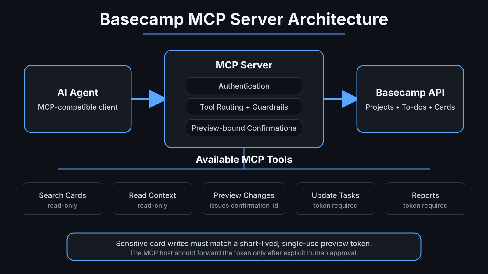

# Basecamp MCP Server

Servidor open source de Model Context Protocol para projetos, mensagens, tarefas, recordings e Card Tables do Basecamp. Ele foi pensado para fluxos operacionais em que um assistente de IA precisa buscar contexto, preparar alterações e manter mutações sensíveis em cards atrás de aprovação explícita vinculada a um preview.

> [!IMPORTANT]
> Este é um projeto independente da comunidade. Ele não é afiliado, patrocinado ou endossado pela 37signals ou pelo Basecamp.



## Principais recursos

- Descoberta de projetos e ferramentas habilitadas.
- Busca de to-dos e cards por título ou responsável.
- Paginação automática da API.
- Ferramentas de escrita desligadas por padrão.
- Preview obrigatório para alterações sensíveis em Card Tables.
- Tokens de confirmação curtos e de uso único, vinculados ao card e ao payload exatos.
- Bloqueio de escrita quando mais de um item corresponde ao título.
- OAuth com renovação de token.
- CI com lint, type check, testes e auditoria de dependências.

## Como funciona a confirmação vinculada ao preview

Os fluxos sensíveis de Card Table usam duas etapas:

1. Chame uma tool de preview.
2. Mostre o preview ao usuário.
3. O preview retorna um `confirmation_id` temporário, vinculado ao card e ao conteúdo exatos.
4. Depois da aprovação explícita, chame a tool de escrita correspondente com esse `confirmation_id`.
5. O servidor verifica se a escrita é exatamente a mesma que foi mostrada e consome o token.

O token não pode ser reutilizado e não autoriza payload alterado.

> [!NOTE]
> O servidor garante preview-before-write e vínculo exato do payload. O cliente MCP continua responsável por só repassar o `confirmation_id` depois da aprovação real do usuário.

## Instalação

```bash
uv tool install git+https://github.com/thiagorchaves/basecamp-mcp-server.git
```

Para desenvolvimento:

```bash
git clone https://github.com/thiagorchaves/basecamp-mcp-server.git
cd basecamp-mcp-server
uv sync --extra dev
```

## OAuth do Basecamp

Registre uma aplicação na área de integrações da 37signals e configure:

```text
http://localhost:8000/callback
```

Prepare o ambiente:

```bash
cp .env.example .env
chmod 600 .env
```

Preencha:

```dotenv
BASECAMP_CLIENT_ID=seu_client_id
BASECAMP_CLIENT_SECRET=seu_client_secret
BASECAMP_REDIRECT_URI=http://localhost:8000/callback
BASECAMP_USER_AGENT=Basecamp MCP Server (voce@example.com)
```

Autorize:

```bash
basecamp-oauth
```

Renove um token expirado:

```bash
basecamp-oauth --refresh
```

Teste a conexão:

```bash
basecamp-test
```

## Escrita segura

As tools que alteram o Basecamp só são registradas quando:

```dotenv
BASECAMP_ENABLE_WRITE_TOOLS=true
```

Mantenha `false` para uso somente leitura. Mesmo com escrita habilitada, deixe tools de mutação fora do `autoApprove` do cliente MCP.

Os tokens de confirmação expiram por padrão em cinco minutos:

```dotenv
BASECAMP_CONFIRMATION_TTL_SECONDS=300
```

Estas escritas de Card Table exigem token válido de preview:

- `add_card_update` a partir de `preview_card_update`
- `update_card_due_date` a partir de `preview_card_due_date`
- `add_investigation_report_to_card` a partir de `preview_investigation_report_to_card`

Outras tools opcionais de escrita continuam protegidas por `BASECAMP_ENABLE_WRITE_TOOLS=true` e pelos controles de aprovação do cliente MCP.

## Configuração no Kiro

```json
{
  "mcpServers": {
    "basecamp": {
      "command": "uvx",
      "args": [
        "--from",
        "git+https://github.com/thiagorchaves/basecamp-mcp-server.git",
        "basecamp-mcp"
      ],
      "env": {
        "BASECAMP_ACCOUNT_ID": "${BASECAMP_ACCOUNT_ID}",
        "BASECAMP_ACCESS_TOKEN": "${BASECAMP_ACCESS_TOKEN}",
        "BASECAMP_USER_AGENT": "${BASECAMP_USER_AGENT}",
        "BASECAMP_ENABLE_WRITE_TOOLS": "false",
        "BASECAMP_CONFIRMATION_TTL_SECONDS": "300"
      },
      "autoApprove": []
    }
  }
}
```

## Tools principais

### Leitura e preview

- `healthcheck`
- `list_projects`, `find_projects`, `find_project_by_name`, `get_project`
- `get_project_tools`
- `list_messages`
- `list_todolists`, `list_project_todolists`, `list_todos`
- `list_project_todos`, `find_todos_by_title`
- `get_recording`
- `list_project_card_tables`, `get_card_table`, `list_cards`
- `find_cards_by_title`, `find_cards_by_assignee`, `get_my_cards`
- `preview_card_update`
- `preview_card_due_date`
- `preview_investigation_report_to_card`

### Escrita habilitada

- `create_message`, `create_project_message`
- `create_project_message_from_markdown`
- `create_todo`, `create_todo_from_markdown`
- `update_card_by_title`
- `add_comment`, `comment_recording_from_markdown`
- `add_card_update` (exige token de preview)
- `update_card_due_date` (exige token de preview)
- `add_investigation_report_to_card` (exige token de preview)

## Fluxo recomendado para cards

1. Localize o projeto e o card.
2. Mostre título, coluna, URL e estado atual.
3. Gere o preview da alteração.
4. Mostre o preview e peça confirmação explícita.
5. Passe o `confirmation_id` retornado para a tool de escrita correspondente.
6. Leia novamente o recurso e confirme o resultado final.

## Desenvolvimento

```bash
uv sync --extra dev
uv run ruff format --check .
uv run ruff check .
uv run mypy basecamp_mcp
uv run pytest
```

O CI testa Python 3.11, 3.12 e 3.13 e executa auditoria agendada de dependências.

## Segurança

Nunca faça commit de `.env`, tokens OAuth, IDs de contas privadas ou respostas reais de API contendo dados de pessoas e projetos. Consulte [SECURITY.md](SECURITY.md).

## Licença

MIT. Consulte [LICENSE](LICENSE).
